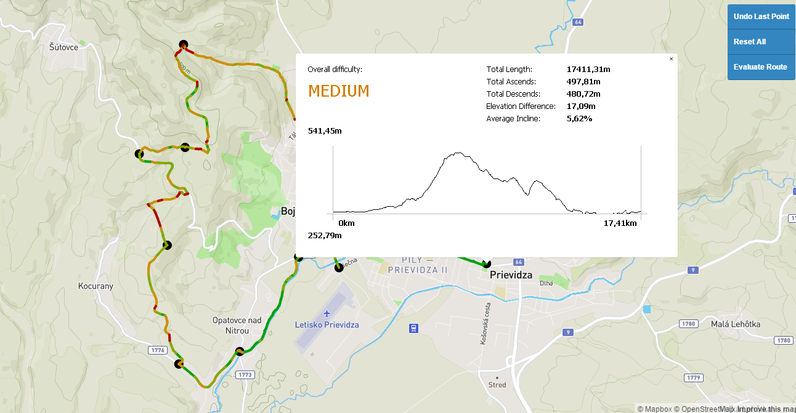

# Overview

Application provides background for bicycle/foot hikes. Its principle can be summed as follws:
- User selects a number of points on the map
- App traces a route between the points using opencyclemap routes (incl. bike and foot pathways)
- The route is shown on the map, route segments are colored (green, brown, orange, red) by their difficulty (incline or decline steepness)
- Any time, user can modify the selection of points by moving or deleting them
- When finished, the app fetches the statistics about the route - i.e. total distance, total elevation and shows an altitude chart

The functionality is summed in the short big-picture manual

Example of the App in action:

The application has 3 separate parts, the client which is a [frontend web application](#frontend) using mapbox API and mapbox.js and the [backend application](#javabackend) written in Java, backed by [PostGIS](#sqlbackend)  with custom PL/PGSQL functions. The frontend application communicates with backend using Java-JS interface [Direct Web Remoting](http://directwebremoting.org/dwr/index.html). A migration to a stateful interface, e.g. Apache Wicket is planned.

# Frontend

The frontend application is a static HTML page (`MapPage.html`), which shows a mapbox.js widget. It provides only means of user interaction and visualization. 

All relevant frontend code is separated to main HTML document and `MapPageScripts.js` as follows:
- HTML document contains code relevant to variables creation and event listeners initialization.
- MapPageScripts.js contains functionality implementation.

# JavaBackend

The backend application is written in Java and is responsible for querying geo data, computing statistics about the Route and formatting the geojson and data for the frontend. The structure uses packages as follows:
- sk.fiit.pdt.tomaas: Main controllers with of the app
- sk.fiit.pdt.tomaas.entities: Model for geodata, e.g. GeoRouteSegment
- sk.fiit.pdt.tomaas.services: Stateless service runners for PostGIS interaction 

# SQLBackend

For sake of improving the ap performance by eliminationg the amount of data being transferred to/from PostGIS is the majority of the querying services implemented by PL/PGSQL. It includes:
- Selecting the data relevant for route tracing using bounding octagons (and their creation)
- Selecting the nearest point in all paths to a specified coordinate (during point addition or movement)
- Tracing the route between two specific points using [PgRouting](http://pgrouting.org/)
- Querying in SRTM elevation data. This step is performed by [bilinear interpolation](https://en.wikipedia.org/wiki/Bilinear_interpolation) to improve accuracy.

The querying performance is also improved using gist spatial indices.

# Data

The app uses two separate sources of data:

## OpenStreetMap

OSM data are fetched by [OverpassAPI](https://overpass-turbo.eu/) using a script `overpass-query.txt`. Transformation into PostGIS DB is done by [Osmosis](https://github.com/openstreetmap/osmosis).
The data includes only routes (car, bike and footway)

## Nasa SRTM

Nasa SRTM provides world elevation data as a height map raster. Current data available (called SRTM 90 or SRTM 3) have 3 arc second (in our latitude equiv. to apx. 90m) spatial an 1m elevational resolution.
Most recently, improved SRTM30/1 data have been released providing 3 times greater spatial resolution, so a migration is planned. As point heights are precomputed, this would not affect the computational complexity

